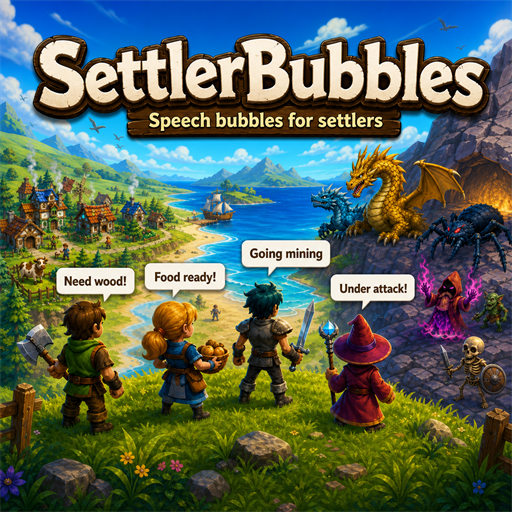

# Settler Bubbles



Settler Bubbles is a Necesse 1.3.2 mod inspired by RimWorld's Interaction
Bubbles. It turns existing settler chatter into readable conversations and adds
short contextual lines for social life, work, needs, mood, weather and combat.

Created by [DrapoMods](https://github.com/drapomods).

## Features

- Shared, server-selected dialogue in singleplayer and multiplayer.
- Supports recruited settlers and visiting human NPCs.
- Multi-turn conversations that remember whether the topic was a person, animal
  or food, including matching reactions and conclusions.
- 160 personality-aware English dialogue lines.
- Compact pixel speech bubbles, thought bubbles for needs and mood, and distinct
  combat shouts that follow their speaker.
- Context for hunger, injuries, recreation, strikes, happiness, rain, night,
  visitors, jobs and idle settlers.
- Enabled automatically on every game start.
- Session toggle with `/bubbles` or `/bubbles on|off`.
- Configurable frequency, distance, duration and event categories.
- A versioned Java API for add-on mods and compatibility integrations.
- No world save data; the mod can be added or removed safely.

## Requirements and installation

Settler Bubbles 1.0.0 targets Necesse 1.3.2. In multiplayer, install the same
mod version on the host or dedicated server and on every connecting client.

Subscribe through the [Steam Workshop](https://steamcommunity.com/sharedfiles/filedetails/?id=3779949320),
or place the release jar manually in
`%APPDATA%\Necesse\mods\` and enable Settler Bubbles in the game's Mods menu.

## Commands and settings

- `/bubbles` toggles bubbles for the current play session.
- `/bubbles on` enables them for the current session.
- `/bubbles off` disables them for the current session.

Frequency, visibility distance, duration and event categories can be adjusted
in the mod settings. Bubbles start enabled; no command is required after launch.

## Java API

The public API is in `drapomods.settlerbubbles.api`. Add-on mods should declare
`drapomods.settlerbubbles` as a dependency and check
`SettlerBubblesAPI.API_VERSION` before registering integrations.

Show one bubble directly from server-side code:

```java
SettlerBubblesAPI.showBubble(BubbleRequest.builder(
        settler,
        new LocalMessage("mymod", "foundtreasure")
    )
    .category(BubbleCategory.MOOD)
    .style(BubbleStyle.THOUGHT)
    .duration(4000)
    .cooldown(5000)
    .build());
```

Providers let multiple mods contribute weighted lines to the same namespaced
event. Keep the returned handle if the provider may need to be unregistered:

```java
RegistrationHandle handle = SettlerBubblesAPI.registerProvider(
    "mymod:treasure_dialogue",
    context -> {
        if (!context.getTriggerID().equals("mymod:found_treasure")) {
            return Collections.emptyList();
        }
        return Collections.singletonList(
            BubbleLine.local("mymod", "treasurereaction")
                .weight(10)
                .duration(4200)
                .style(BubbleStyle.SPEECH)
                .build()
        );
    }
);

SettlerBubblesAPI.fireEvent(BubbleContext.builder(
        "mymod:found_treasure", settler)
    .category(BubbleCategory.MOOD)
    .attribute("rarity", "legendary")
    .build());
```

`showBubble` and `fireEvent` must run on the server. The API applies category
settings and cooldowns and synchronizes the selected bubble to all clients on
the speaker's level.

## Development

Copy `gradle.properties.example` to `gradle.properties` and set `necesseDir` to
your Necesse installation. You can instead pass `-PnecesseDir=...` or set the
`NECESSE_DIR` environment variable. Common Windows Steam locations are detected
automatically.

- `gradlew.bat buildModJar` builds the distributable jar.
- `gradlew.bat runClient` launches the normal development client.
- `gradlew.bat runDevClient` launches a second client.
- `gradlew.bat runServer` launches a dedicated server.

## Support

- Report bugs or request features through [GitHub Issues](https://github.com/drapomods/settler-bubbles/issues).
- Download or subscribe through the [Steam Workshop](https://steamcommunity.com/sharedfiles/filedetails/?id=3779949320).
- Private contact: [drapomods@proton.me](mailto:drapomods@proton.me)
- Reddit: [u/DrapoMods](https://www.reddit.com/user/DrapoMods/)
- Discord: `DrapoMods`

When reporting a bug, include the Settler Bubbles version, Necesse version,
singleplayer/server type, reproduction steps, other installed mods and the
relevant part of `%APPDATA%\Necesse\latest-log.txt`.

## License and disclaimer

The source code is available under the [MIT License](LICENSE). The logo,
preview and DrapoMods branding are covered separately by the
[artwork and branding license](ASSET-LICENSE.md).

Settler Bubbles is an unofficial fan-made mod and is not affiliated with or
endorsed by Fair Games or Ludeon Studios. Necesse, RimWorld and their respective
names and trademarks belong to their owners.
